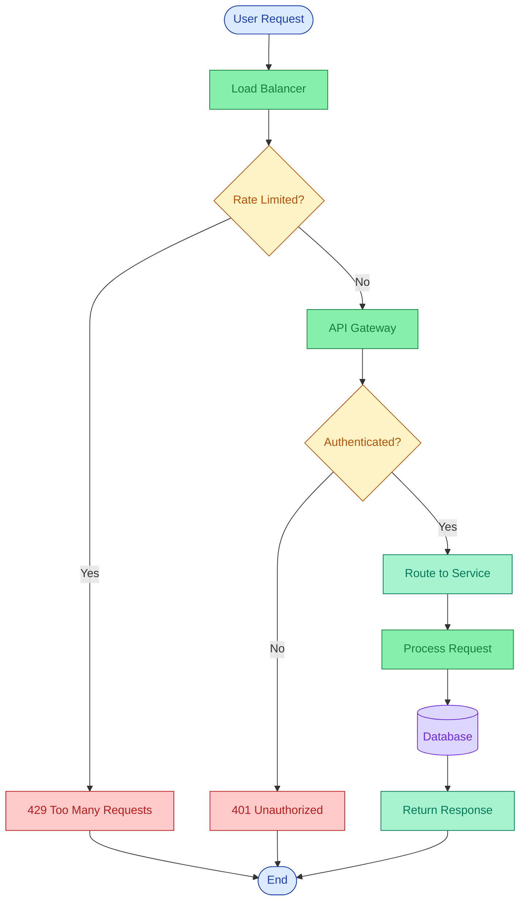
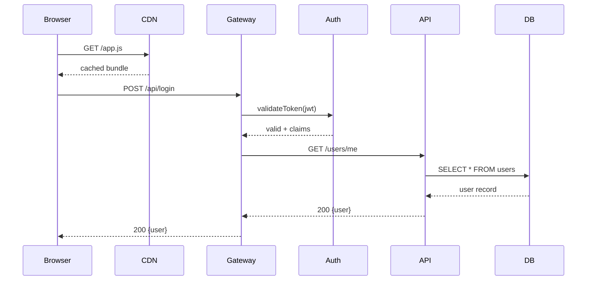
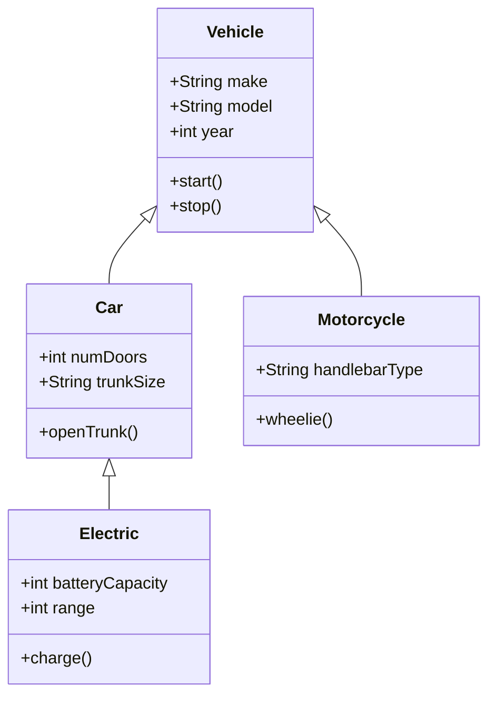
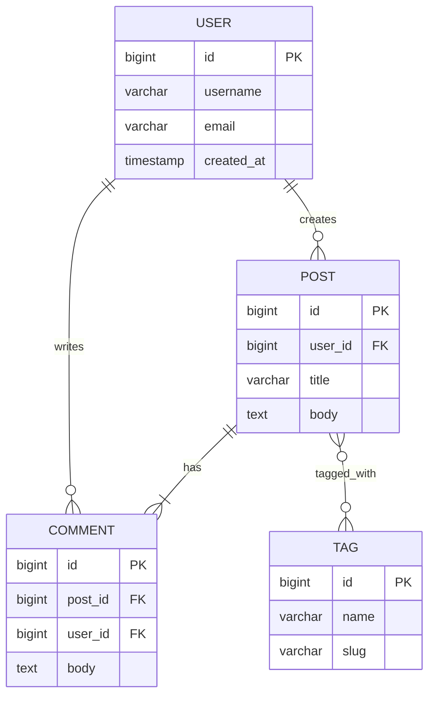

# excalibrain Example Gallery

> Generated: 2026-03-23
> All diagrams generated fresh from source inputs.

## Performance Summary

| # | Diagram | Path | Theme | Conversion | Export | Total | PNG Size | Status |
|---|---------|------|-------|------------|--------|-------|----------|--------|
| 1 | Architecture (Default) | dagre | default | 57ms | 1928ms | 1985ms | 57 KB (852x955) | PASS |
| 2 | Architecture (Dark) | dagre | dark | 57ms | 1926ms | 1983ms | 52 KB (852x955) | PASS |
| 3 | Architecture (Clean) | dagre | clean | 58ms | 1905ms | 1963ms | 51 KB (852x955) | PASS |
| 4 | Architecture (Blueprint) | dagre | blueprint | 58ms | 1937ms | 1995ms | 49 KB (852x955) | PASS |
| 5 | State Diagram | dagre | default | 56ms | 1822ms | 1878ms | 17 KB (1290x308) | PASS |
| 6 | Mindmap | dagre | default | 56ms | 1864ms | 1920ms | 37 KB (770x810) | PASS |
| 7 | Gantt | dagre | default | 54ms | 2314ms | 2368ms | 20 KB (1460x263) | PASS |
| 8 | Flowchart | mermaid | default | 2476ms | 2024ms | 4500ms | 55 KB (824x1425) | PASS |
| 9 | Sequence | mermaid | default | 2247ms | 1900ms | 4147ms | 50 KB (1217x650) | PASS |
| 10 | Class Diagram | mermaid | default | 2381ms | 1857ms | 4238ms | 34 KB (582x776) | PASS |
| 11 | ER Diagram | mermaid | default | 2338ms | 1973ms | 4311ms | 48 KB (608x973) | PASS |
| 12 | Flowchart (Dark) | mermaid | dark | 2212ms | 2050ms | 4262ms | 54 KB (824x1425) | PASS |

**Totals:** 12/12 diagrams generated successfully. Dagre avg: ~2013ms. Mermaid avg: ~4292ms.

---

## 1. Architecture (Default Theme)

**Path:** dagre | **Theme:** default

### Input
```json
{
  "direction": "TB",
  "title": "Microservices Architecture",
  "rankSep": 100,
  "nodeSep": 50,
  "zones": [
    {
      "id": "zone_clients",
      "label": "CLIENTS",
      "labelColor": "#0369a1",
      "fill": "#e0f2fe",
      "stroke": "#7dd3fc",
      "nodeIds": ["browser", "mobile"]
    },
    {
      "id": "zone_gateway",
      "label": "GATEWAY",
      "labelColor": "#166534",
      "fill": "#f0fdf4",
      "stroke": "#86efac",
      "nodeIds": ["api_gateway"]
    },
    {
      "id": "zone_services",
      "label": "SERVICES",
      "labelColor": "#9a3412",
      "fill": "#fff7ed",
      "stroke": "#fdba74",
      "nodeIds": ["auth", "users", "orders", "payments"]
    },
    {
      "id": "zone_data",
      "label": "DATA",
      "labelColor": "#6b21a8",
      "fill": "#faf5ff",
      "stroke": "#d8b4fe",
      "nodeIds": ["postgresql", "redis", "rabbitmq"]
    }
  ],
  "nodes": [
    {
      "id": "browser",
      "label": "Browser",
      "fill": "#bae6fd",
      "stroke": "#0284c7",
      "shape": "rectangle",
      "rounded": true
    },
    {
      "id": "mobile",
      "label": "Mobile App",
      "fill": "#bae6fd",
      "stroke": "#0284c7",
      "shape": "rectangle",
      "rounded": true
    },
    {
      "id": "api_gateway",
      "label": "API Gateway",
      "fill": "#bbf7d0",
      "stroke": "#16a34a",
      "shape": "rectangle",
      "rounded": true
    },
    {
      "id": "auth",
      "label": "Auth Service",
      "fill": "#fed7aa",
      "stroke": "#ea580c",
      "shape": "rectangle",
      "rounded": false
    },
    {
      "id": "users",
      "label": "Users Service",
      "fill": "#fed7aa",
      "stroke": "#ea580c",
      "shape": "rectangle",
      "rounded": false
    },
    {
      "id": "orders",
      "label": "Orders Service",
      "fill": "#fed7aa",
      "stroke": "#ea580c",
      "shape": "rectangle",
      "rounded": false
    },
    {
      "id": "payments",
      "label": "Payments Service",
      "fill": "#fed7aa",
      "stroke": "#ea580c",
      "shape": "rectangle",
      "rounded": false
    },
    {
      "id": "postgresql",
      "label": "PostgreSQL",
      "fill": "#e9d5ff",
      "stroke": "#7c3aed",
      "shape": "rectangle",
      "rounded": false
    },
    {
      "id": "redis",
      "label": "Redis",
      "fill": "#e9d5ff",
      "stroke": "#7c3aed",
      "shape": "rectangle",
      "rounded": false
    },
    {
      "id": "rabbitmq",
      "label": "RabbitMQ",
      "fill": "#e9d5ff",
      "stroke": "#7c3aed",
      "shape": "rectangle",
      "rounded": false
    }
  ],
  "edges": [
    {
      "from": "browser",
      "to": "api_gateway",
      "label": "HTTPS",
      "stroke": "#374151",
      "style": "solid",
      "width": 2
    },
    {
      "from": "mobile",
      "to": "api_gateway",
      "label": "HTTPS",
      "stroke": "#374151",
      "style": "solid",
      "width": 2
    },
    {
      "from": "api_gateway",
      "to": "auth",
      "label": "verify token",
      "stroke": "#ea580c",
      "style": "solid",
      "width": 2
    },
    {
      "from": "api_gateway",
      "to": "users",
      "label": "REST",
      "stroke": "#374151",
      "style": "solid",
      "width": 1.5
    },
    {
      "from": "api_gateway",
      "to": "orders",
      "label": "REST",
      "stroke": "#374151",
      "style": "solid",
      "width": 1.5
    },
    {
      "from": "api_gateway",
      "to": "payments",
      "label": "REST",
      "stroke": "#374151",
      "style": "solid",
      "width": 1.5
    },
    {
      "from": "auth",
      "to": "redis",
      "label": "sessions",
      "stroke": "#7c3aed",
      "style": "solid",
      "width": 1.5
    },
    {
      "from": "users",
      "to": "postgresql",
      "label": "read/write",
      "stroke": "#7c3aed",
      "style": "solid",
      "width": 1.5
    },
    {
      "from": "orders",
      "to": "postgresql",
      "label": "read/write",
      "stroke": "#7c3aed",
      "style": "solid",
      "width": 1.5
    },
    {
      "from": "payments",
      "to": "postgresql",
      "label": "read/write",
      "stroke": "#7c3aed",
      "style": "solid",
      "width": 1.5
    },
    {
      "from": "orders",
      "to": "rabbitmq",
      "label": "order.created",
      "stroke": "#d97706",
      "style": "dashed",
      "width": 1.5
    },
    {
      "from": "rabbitmq",
      "to": "payments",
      "label": "process payment",
      "stroke": "#d97706",
      "style": "dashed",
      "width": 1.5
    }
  ]
}
```

### Commands
```bash
node tools/dagre-layout.js examples/architecture/graph.json --output examples/architecture/architecture.excalidraw
node tools/export.js examples/architecture/architecture.excalidraw --format png --output examples/architecture/architecture.png
```

### Timing
| Step | Time |
|------|------|
| Conversion (dagre) | 57ms |
| Export (PNG) | 1928ms |
| **Total** | **1985ms** |

### Output
- `examples/architecture/architecture.excalidraw` (43 KB)
- `examples/architecture/architecture.png` (852x955, 57 KB)

### Visual Verification
Four-tier microservices architecture on white background. CLIENTS zone (light blue) contains Browser and Mobile App with rounded blue rectangles. GATEWAY zone (light green) has API Gateway. SERVICES zone (light orange) shows Auth, Users, Orders, and Payments services as sharp-cornered orange rectangles. DATA zone (light purple) contains PostgreSQL, Redis, and RabbitMQ. All edges are labeled (HTTPS, REST, verify token, sessions, read/write, order.created, process payment). Dashed lines correctly distinguish async messaging from synchronous calls. Zone labels are color-coded. Title "Microservices Architecture" displayed at top.

---

## 2. Architecture (Dark Theme)

**Path:** dagre | **Theme:** dark

### Input
Same as #1 (`examples/architecture/graph.json`).

### Commands
```bash
node tools/dagre-layout.js examples/architecture/graph.json --theme dark --output examples/architecture/architecture-dark.excalidraw
node tools/export.js examples/architecture/architecture-dark.excalidraw --format png --output examples/architecture/architecture-dark.png
```

### Timing
| Step | Time |
|------|------|
| Conversion (dagre) | 57ms |
| Export (PNG) | 1926ms |
| **Total** | **1983ms** |

### Output
- `examples/architecture/architecture-dark.excalidraw` (43 KB)
- `examples/architecture/architecture-dark.png` (852x955, 52 KB)

### Visual Verification
Same layout as default but rendered on a dark navy/charcoal background (#121826). Zone fills are semi-transparent dark overlays. Node colors remain visible against the dark background. Edge labels and zone labels use lighter tones for readability. The title and all text are legible on dark background. Zones have subtle dark-tinted fills while preserving the original color distinctions.

---

## 3. Architecture (Clean Theme)

**Path:** dagre | **Theme:** clean

### Input
Same as #1 (`examples/architecture/graph.json`).

### Commands
```bash
node tools/dagre-layout.js examples/architecture/graph.json --theme clean --output examples/architecture/architecture-clean.excalidraw
node tools/export.js examples/architecture/architecture-clean.excalidraw --format png --output examples/architecture/architecture-clean.png
```

### Timing
| Step | Time |
|------|------|
| Conversion (dagre) | 58ms |
| Export (PNG) | 1905ms |
| **Total** | **1963ms** |

### Output
- `examples/architecture/architecture-clean.excalidraw` (43 KB)
- `examples/architecture/architecture-clean.png` (852x955, 51 KB)

### Visual Verification
Same layout on white background. Very similar to default theme. Colors are preserved from the input JSON. Clean rendering with no roughness/hand-drawn style. All zones, nodes, edges, and labels are present and correctly positioned. Compared to default, the clean theme appears almost identical but with crisper lines.

---

## 4. Architecture (Blueprint Theme)

**Path:** dagre | **Theme:** blueprint

### Input
Same as #1 (`examples/architecture/graph.json`).

### Commands
```bash
node tools/dagre-layout.js examples/architecture/graph.json --theme blueprint --output examples/architecture/architecture-blueprint.excalidraw
node tools/export.js examples/architecture/architecture-blueprint.excalidraw --format png --output examples/architecture/architecture-blueprint.png
```

### Timing
| Step | Time |
|------|------|
| Conversion (dagre) | 58ms |
| Export (PNG) | 1937ms |
| **Total** | **1995ms** |

### Output
- `examples/architecture/architecture-blueprint.excalidraw` (43 KB)
- `examples/architecture/architecture-blueprint.png` (852x955, 49 KB)

### Visual Verification
Dark navy/charcoal background similar to dark theme. Node fills retain their original colors from the JSON but appear on the dark backdrop. Zone fills are darkened/semi-transparent overlays. Edge labels use lighter colors (orange for "order.created", "process payment"). The blueprint theme gives a technical-drawing aesthetic with the dark background. All text remains legible.

---

## 5. State Diagram (Order Lifecycle)

**Path:** dagre | **Theme:** default

### Input
```json
{
  "direction": "LR",
  "title": "Order Lifecycle",
  "rankSep": 80,
  "nodeSep": 50,
  "style": {
    "roughness": 0,
    "fontFamily": 2,
    "fontSize": 16
  },
  "nodes": [
    {
      "id": "start",
      "label": "",
      "shape": "ellipse",
      "width": 30,
      "height": 30,
      "fill": "#374151",
      "stroke": "#374151",
      "fillStyle": "solid"
    },
    {
      "id": "placed",
      "label": "Placed",
      "shape": "rectangle",
      "rounded": true,
      "fill": "#86efac",
      "stroke": "#15803d"
    },
    {
      "id": "processing",
      "label": "Processing",
      "shape": "rectangle",
      "rounded": true,
      "fill": "#86efac",
      "stroke": "#15803d"
    },
    {
      "id": "shipped",
      "label": "Shipped",
      "shape": "rectangle",
      "rounded": true,
      "fill": "#86efac",
      "stroke": "#15803d"
    },
    {
      "id": "delivered",
      "label": "Delivered",
      "shape": "rectangle",
      "rounded": true,
      "fill": "#86efac",
      "stroke": "#15803d"
    },
    {
      "id": "cancelled",
      "label": "Cancelled",
      "shape": "rectangle",
      "rounded": true,
      "fill": "#fecaca",
      "stroke": "#b91c1c"
    },
    {
      "id": "refunded",
      "label": "Refunded",
      "shape": "rectangle",
      "rounded": true,
      "fill": "#fed7aa",
      "stroke": "#c2410c"
    },
    {
      "id": "end",
      "label": "",
      "shape": "ellipse",
      "width": 30,
      "height": 30,
      "fill": "#374151",
      "stroke": "#374151",
      "fillStyle": "solid"
    }
  ],
  "edges": [
    { "from": "start", "to": "placed", "stroke": "#15803d" },
    { "from": "placed", "to": "processing", "stroke": "#15803d" },
    { "from": "processing", "to": "shipped", "stroke": "#15803d" },
    { "from": "shipped", "to": "delivered", "stroke": "#15803d" },
    { "from": "delivered", "to": "end", "stroke": "#15803d" },
    { "from": "placed", "to": "cancelled", "stroke": "#b91c1c", "style": "dashed", "label": "cancel" },
    { "from": "processing", "to": "cancelled", "stroke": "#b91c1c", "style": "dashed", "label": "cancel" },
    { "from": "delivered", "to": "refunded", "stroke": "#c2410c", "style": "dashed", "label": "refund" }
  ]
}
```

### Commands
```bash
node tools/dagre-layout.js examples/state-diagram/graph.json --output examples/state-diagram/state-diagram.excalidraw
node tools/export.js examples/state-diagram/state-diagram.excalidraw --format png --output examples/state-diagram/state-diagram.png
```

### Timing
| Step | Time |
|------|------|
| Conversion (dagre) | 56ms |
| Export (PNG) | 1822ms |
| **Total** | **1878ms** |

### Output
- `examples/state-diagram/state-diagram.excalidraw` (23 KB)
- `examples/state-diagram/state-diagram.png` (1290x308, 17 KB)

### Visual Verification
Left-to-right state machine. Dark filled start circle on the left, followed by green rounded states: Placed -> Processing -> Shipped -> Delivered, ending at a dark filled end circle. Dashed red "cancel" edges branch upward from Placed and Processing to a pink "Cancelled" state. A dashed orange "refund" edge branches from Delivered to an orange "Refunded" state. Clean horizontal flow with clear branching for error states.

---

## 6. Mindmap (Software Engineering)

**Path:** dagre | **Theme:** default

### Input
```json
{
  "direction": "LR",
  "rankSep": 100,
  "nodeSep": 30,
  "arrowhead": null,
  "style": {
    "roughness": 0,
    "fontFamily": 2,
    "fontSize": 15,
    "defaultArrowColor": "#94a3b8"
  },
  "nodes": [
    {
      "id": "root",
      "label": "Software\nEngineering",
      "shape": "ellipse",
      "width": 180,
      "height": 70,
      "fill": "#1e293b",
      "stroke": "#e2e8f0",
      "textColor": "#ffffff"
    },
    {
      "id": "frontend",
      "label": "Frontend",
      "shape": "rectangle",
      "rounded": true,
      "fill": "#bfdbfe",
      "stroke": "#1e40af"
    },
    {
      "id": "backend",
      "label": "Backend",
      "shape": "rectangle",
      "rounded": true,
      "fill": "#86efac",
      "stroke": "#15803d"
    },
    {
      "id": "devops",
      "label": "DevOps",
      "shape": "rectangle",
      "rounded": true,
      "fill": "#fed7aa",
      "stroke": "#c2410c"
    },
    {
      "id": "testing",
      "label": "Testing",
      "shape": "rectangle",
      "rounded": true,
      "fill": "#fef08a",
      "stroke": "#92400e"
    },
    {
      "id": "architecture",
      "label": "Architecture",
      "shape": "rectangle",
      "rounded": true,
      "fill": "#ddd6fe",
      "stroke": "#6d28d9"
    },
    {
      "id": "fe_react",
      "label": "React",
      "shape": "rectangle",
      "rounded": true,
      "fill": "#dbeafe",
      "stroke": "#3b82f6"
    },
    {
      "id": "fe_css",
      "label": "CSS / Tailwind",
      "shape": "rectangle",
      "rounded": true,
      "fill": "#dbeafe",
      "stroke": "#3b82f6"
    },
    {
      "id": "be_api",
      "label": "REST APIs",
      "shape": "rectangle",
      "rounded": true,
      "fill": "#a7f3d0",
      "stroke": "#047857"
    },
    {
      "id": "be_db",
      "label": "Databases",
      "shape": "rectangle",
      "rounded": true,
      "fill": "#a7f3d0",
      "stroke": "#047857"
    },
    {
      "id": "do_ci",
      "label": "CI / CD",
      "shape": "rectangle",
      "rounded": true,
      "fill": "#fef3c7",
      "stroke": "#b45309"
    },
    {
      "id": "do_containers",
      "label": "Containers",
      "shape": "rectangle",
      "rounded": true,
      "fill": "#fef3c7",
      "stroke": "#b45309"
    },
    {
      "id": "t_unit",
      "label": "Unit Tests",
      "shape": "rectangle",
      "rounded": true,
      "fill": "#fef9c3",
      "stroke": "#a16207"
    },
    {
      "id": "t_e2e",
      "label": "E2E Tests",
      "shape": "rectangle",
      "rounded": true,
      "fill": "#fef9c3",
      "stroke": "#a16207"
    },
    {
      "id": "a_patterns",
      "label": "Design Patterns",
      "shape": "rectangle",
      "rounded": true,
      "fill": "#ede9fe",
      "stroke": "#7c3aed"
    },
    {
      "id": "a_micro",
      "label": "Microservices",
      "shape": "rectangle",
      "rounded": true,
      "fill": "#ede9fe",
      "stroke": "#7c3aed"
    }
  ],
  "edges": [
    { "from": "root", "to": "frontend", "stroke": "#94a3b8" },
    { "from": "root", "to": "backend", "stroke": "#94a3b8" },
    { "from": "root", "to": "devops", "stroke": "#94a3b8" },
    { "from": "root", "to": "testing", "stroke": "#94a3b8" },
    { "from": "root", "to": "architecture", "stroke": "#94a3b8" },
    { "from": "frontend", "to": "fe_react", "stroke": "#94a3b8" },
    { "from": "frontend", "to": "fe_css", "stroke": "#94a3b8" },
    { "from": "backend", "to": "be_api", "stroke": "#94a3b8" },
    { "from": "backend", "to": "be_db", "stroke": "#94a3b8" },
    { "from": "devops", "to": "do_ci", "stroke": "#94a3b8" },
    { "from": "devops", "to": "do_containers", "stroke": "#94a3b8" },
    { "from": "testing", "to": "t_unit", "stroke": "#94a3b8" },
    { "from": "testing", "to": "t_e2e", "stroke": "#94a3b8" },
    { "from": "architecture", "to": "a_patterns", "stroke": "#94a3b8" },
    { "from": "architecture", "to": "a_micro", "stroke": "#94a3b8" }
  ]
}
```

### Commands
```bash
node tools/dagre-layout.js examples/mindmap/graph.json --output examples/mindmap/mindmap.excalidraw
node tools/export.js examples/mindmap/mindmap.excalidraw --format png --output examples/mindmap/mindmap.png
```

### Timing
| Step | Time |
|------|------|
| Conversion (dagre) | 56ms |
| Export (PNG) | 1864ms |
| **Total** | **1920ms** |

### Output
- `examples/mindmap/mindmap.excalidraw` (39 KB)
- `examples/mindmap/mindmap.png` (770x810, 37 KB)

### Visual Verification
Left-to-right tree/mindmap layout. Central dark ellipse labeled "Software Engineering" (white text) on the left, branching right to five color-coded categories: Architecture (purple), Testing (yellow), DevOps (orange), Backend (green), Frontend (blue). Each category then branches further to two leaf nodes. Architecture -> Design Patterns, Microservices. Testing -> E2E Tests, Unit Tests. DevOps -> Containers, CI/CD. Backend -> Databases, REST APIs. Frontend -> CSS/Tailwind, React. Gray connector lines throughout. Clean three-level hierarchy.

---

## 7. Gantt (Product Launch Timeline)

**Path:** dagre | **Theme:** default

### Input
```json
{
  "direction": "LR",
  "title": "Product Launch Timeline",
  "rankSep": 60,
  "nodeSep": 40,
  "style": {
    "roughness": 0,
    "fontFamily": 2,
    "fontSize": 15
  },
  "nodes": [
    {
      "id": "research",
      "label": "Research",
      "shape": "rectangle",
      "rounded": true,
      "width": 180,
      "height": 50,
      "fill": "#bfdbfe",
      "stroke": "#1e40af"
    },
    {
      "id": "design",
      "label": "Design",
      "shape": "rectangle",
      "rounded": true,
      "width": 200,
      "height": 50,
      "fill": "#bfdbfe",
      "stroke": "#1e40af"
    },
    {
      "id": "backend",
      "label": "Backend Dev",
      "shape": "rectangle",
      "rounded": true,
      "width": 240,
      "height": 50,
      "fill": "#86efac",
      "stroke": "#15803d"
    },
    {
      "id": "frontend",
      "label": "Frontend Dev",
      "shape": "rectangle",
      "rounded": true,
      "width": 240,
      "height": 50,
      "fill": "#86efac",
      "stroke": "#15803d"
    },
    {
      "id": "qa",
      "label": "QA & Testing",
      "shape": "rectangle",
      "rounded": true,
      "width": 180,
      "height": 50,
      "fill": "#fef08a",
      "stroke": "#92400e"
    },
    {
      "id": "beta",
      "label": "Beta Release",
      "shape": "rectangle",
      "rounded": true,
      "width": 160,
      "height": 50,
      "fill": "#fed7aa",
      "stroke": "#c2410c"
    },
    {
      "id": "launch",
      "label": "Launch!",
      "shape": "rectangle",
      "rounded": true,
      "width": 140,
      "height": 50,
      "fill": "#86efac",
      "stroke": "#15803d"
    }
  ],
  "edges": [
    { "from": "research", "to": "design", "label": "Week 2", "stroke": "#1e40af" },
    { "from": "design", "to": "backend", "label": "Week 4", "stroke": "#15803d" },
    { "from": "design", "to": "frontend", "label": "Week 4", "stroke": "#15803d" },
    { "from": "backend", "to": "qa", "stroke": "#92400e" },
    { "from": "frontend", "to": "qa", "stroke": "#92400e" },
    { "from": "qa", "to": "beta", "label": "Week 10", "stroke": "#c2410c" },
    { "from": "beta", "to": "launch", "label": "Week 12", "stroke": "#15803d" }
  ]
}
```

### Commands
```bash
node tools/dagre-layout.js examples/gantt/graph.json --output examples/gantt/gantt.excalidraw
node tools/export.js examples/gantt/gantt.excalidraw --format png --output examples/gantt/gantt.png
```

### Timing
| Step | Time |
|------|------|
| Conversion (dagre) | 54ms |
| Export (PNG) | 2314ms |
| **Total** | **2368ms** |

### Output
- `examples/gantt/gantt.excalidraw` (22 KB)
- `examples/gantt/gantt.png` (1460x263, 20 KB)

### Visual Verification
Left-to-right timeline/Gantt-style layout. Title "Product Launch Timeline" at top. Research (blue) -> Design (blue) with "Week 2" label. Design splits into parallel paths: Frontend Dev (green, upper) and Backend Dev (green, lower), both labeled "Week 4". Both converge into QA & Testing (yellow). QA -> Beta Release (orange, "Week 10") -> Launch! (green, "Week 12"). Variable-width bars represent task duration. Clean horizontal flow with a fork-join pattern for parallel development.

---

## 8. Flowchart (Mermaid, Default Theme)

**Path:** mermaid | **Theme:** default

### Input


### Commands
```bash
node tools/mermaid-convert.js examples/flowchart/flowchart.mmd --output examples/flowchart/flowchart.excalidraw
node tools/export.js examples/flowchart/flowchart.excalidraw --format png --output examples/flowchart/flowchart.png
```

### Timing
| Step | Time |
|------|------|
| Conversion (mermaid) | 2476ms |
| Export (PNG) | 2024ms |
| **Total** | **4500ms** |

### Output
- `examples/flowchart/flowchart.excalidraw` (42 KB)
- `examples/flowchart/flowchart.png` (824x1425, 55 KB)

### Visual Verification
Top-to-bottom flowchart on white background. "User Request" (blue rounded/stadium shape) at top -> "Load Balancer" (green rectangle) -> "Rate Limited?" (yellow diamond decision). "Yes" branch goes left to red "429 Too Many Requests". "No" branch goes to green "API Gateway" -> "Authenticated?" (yellow diamond). "Yes" -> green "Route to Service" -> green "Process Request" -> purple "Database" (cylinder shape) -> green "Return Response". "No" -> red "401 Unauthorized". All three terminal paths converge to blue "End" node. **classDef colors confirmed:** start=blue, process=green, decision=yellow/amber, error=red/pink, success=teal/mint, data=purple. All colors from the classDef are correctly applied.

---

## 9. Sequence Diagram (Mermaid)

**Path:** mermaid | **Theme:** default

### Input


### Commands
```bash
node tools/mermaid-convert.js examples/sequence/sequence.mmd --output examples/sequence/sequence.excalidraw
node tools/export.js examples/sequence/sequence.excalidraw --format png --output examples/sequence/sequence.png
```

### Timing
| Step | Time |
|------|------|
| Conversion (mermaid) | 2247ms |
| Export (PNG) | 1900ms |
| **Total** | **4147ms** |

### Output
- `examples/sequence/sequence.excalidraw` (47 KB)
- `examples/sequence/sequence.png` (1217x650, 50 KB)

### Visual Verification
Standard sequence diagram with 6 participant boxes across the top and bottom: Browser, CDN, Gateway, Auth, API, DB. Vertical lifelines connect each pair. Solid arrows (->>) for requests: Browser->CDN "GET /app.js", Browser->Gateway "POST /api/login", Gateway->Auth "validateToken(jwt)", Gateway->API "GET /users/me", API->DB "SELECT * FROM users". Dashed arrows (-->> ) for responses: "cached bundle", "valid + claims", "user record", "200 {user}" (twice). Hand-drawn Excalidraw style with readable labels. All 10 messages present and correctly ordered.

---

## 10. Class Diagram (Mermaid)

**Path:** mermaid | **Theme:** default

### Input


### Commands
```bash
node tools/mermaid-convert.js examples/class-diagram/class.mmd --output examples/class-diagram/class.excalidraw
node tools/export.js examples/class-diagram/class.excalidraw --format png --output examples/class-diagram/class.png
```

### Timing
| Step | Time |
|------|------|
| Conversion (mermaid) | 2381ms |
| Export (PNG) | 1857ms |
| **Total** | **4238ms** |

### Output
- `examples/class-diagram/class.excalidraw` (30 KB)
- `examples/class-diagram/class.png` (582x776, 34 KB)

### Visual Verification
UML class diagram with four classes. Vehicle at top with three compartments: name, attributes (+String make, +String model, +int year), methods (+start(), +stop()). Car and Motorcycle inherit from Vehicle (solid lines with triangle arrowheads). Car has +int numDoors, +String trunkSize, +openTrunk(). Motorcycle has +String handlebarType, +wheelie(). Electric inherits from Car with +int batteryCapacity, +int range, +charge(). Three-level hierarchy. Hand-drawn Excalidraw style. All fields and methods are legible.

---

## 11. ER Diagram (Mermaid)

**Path:** mermaid | **Theme:** default

### Input


### Commands
```bash
node tools/mermaid-convert.js examples/er-diagram/er.mmd --output examples/er-diagram/er.excalidraw
node tools/export.js examples/er-diagram/er.excalidraw --format png --output examples/er-diagram/er.png
```

### Timing
| Step | Time |
|------|------|
| Conversion (mermaid) | 2338ms |
| Export (PNG) | 1973ms |
| **Total** | **4311ms** |

### Output
- `examples/er-diagram/er.excalidraw` (65 KB)
- `examples/er-diagram/er.png` (608x973, 48 KB)

### Visual Verification
Entity-relationship diagram with four entities. USER at top with columns: bigint id (PK), varchar username, varchar email, timestamp created_at. POST at middle-right with bigint id (PK), bigint user_id (FK), varchar title, text body. COMMENT at bottom-left with bigint id (PK), bigint post_id (FK), bigint user_id (FK), text body. TAG at bottom-right with bigint id (PK), varchar name, varchar slug. Relationships: USER creates POST (one-to-many), USER writes COMMENT (one-to-many), POST has COMMENT (one-to-many), POST tagged_with TAG (many-to-many). Column types and constraints (PK/FK) are shown in table-style entities. Hand-drawn style.

---

## 12. Flowchart (Mermaid, Dark Theme)

**Path:** mermaid | **Theme:** dark

### Input
Same as #8 (`examples/flowchart/flowchart.mmd`).

### Commands
```bash
node tools/mermaid-convert.js examples/flowchart/flowchart.mmd --theme dark --output examples/flowchart/flowchart-dark.excalidraw
node tools/export.js examples/flowchart/flowchart-dark.excalidraw --format png --output examples/flowchart/flowchart-dark.png
```

### Timing
| Step | Time |
|------|------|
| Conversion (mermaid) | 2212ms |
| Export (PNG) | 2050ms |
| **Total** | **4262ms** |

### Output
- `examples/flowchart/flowchart-dark.excalidraw` (42 KB)
- `examples/flowchart/flowchart-dark.png` (824x1425, 54 KB)

### Visual Verification
Same flowchart layout as #8 but on a dark navy/charcoal background. All node shapes and connections are identical. The classDef colors (blue start, green process, yellow decision, red error, green success, purple data) are preserved and visible against the dark background. Text labels use lighter tones for readability. Dark theme confirmed -- background is clearly dark (#121826 or similar). The dark theme successfully applies to mermaid-converted diagrams.

---

## Notes

- **Dagre path** is significantly faster than the mermaid path (~2s vs ~4.3s total) because dagre-layout.js does pure JSON-to-Excalidraw conversion without browser rendering.
- **Mermaid path** uses headless browser rendering (Puppeteer) to parse Mermaid syntax, which adds ~2.2s of conversion overhead.
- **Theme support** works on both paths: dagre themes (dark, clean, blueprint) and mermaid `--theme dark` both produce correct dark-background outputs.
- **classDef colors** in the flowchart.mmd are correctly preserved in the PNG output -- each node class (start, process, decision, error, success, data) uses its defined fill, stroke, and text color.
- All 12 PNGs were visually verified to contain correct layouts, labels, colors, and connections.
