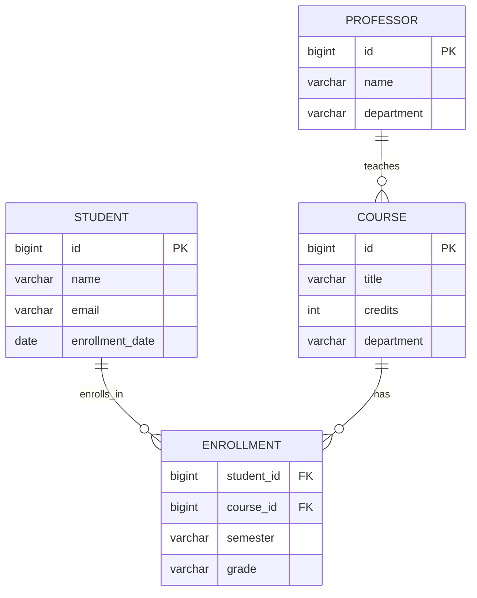

# ER Diagram: University System

## Prompt

"Design an ER diagram for a university system with: Student (id, name, email, enrollment_date), Course (id, title, credits, department), Enrollment (student_id, course_id, semester, grade), and Professor (id, name, department). A professor teaches many courses, a student enrolls in many courses."

## Type Selection

Based on the diagram-type-rubric.md, the keywords "ER diagram", "tables", and "entity relationship" with foreign key relationships map directly to **ER diagram**. No ambiguity.

## Path Choice

**Mermaid path** -- ER diagrams use `mermaid-convert.js` with Mermaid erDiagram syntax per the recipe (`skill/references/diagram-recipes/er-diagram.md`).

## Full Input Content

The Mermaid file (`diagram.mmd`) defines:

### Entities and attributes

| Entity | Attributes |
|--------|-----------|
| STUDENT | id (PK), name, email, enrollment_date |
| COURSE | id (PK), title, credits, department |
| ENROLLMENT | student_id (FK), course_id (FK), semester, grade |
| PROFESSOR | id (PK), name, department |

### Relationships

| Relationship | Cardinality | Meaning |
|-------------|-------------|---------|
| STUDENT -- ENROLLMENT | one-to-many (`\|\|--o{`) | A student has zero or more enrollments |
| COURSE -- ENROLLMENT | one-to-many (`\|\|--o{`) | A course has zero or more enrollments |
| PROFESSOR -- COURSE | one-to-many (`\|\|--o{`) | A professor teaches zero or more courses |

### Mermaid source



## Commands and Timing

```bash
# Step 4: Generate (mermaid path)
node tools/mermaid-convert.js examples/er-diagram/diagram.mmd \
  --output examples/er-diagram/diagram.excalidraw
# Output: 65 native elements, 62KB file
# Completed in <1s

# Step 5: Validate (export to PNG)
node tools/export.js examples/er-diagram/diagram.excalidraw \
  --format png --output examples/er-diagram/diagram.png
# Output: 764x924px, 50KB
```

## Visual Verification Notes

- [x] All 4 entities present: STUDENT, COURSE, ENROLLMENT, PROFESSOR
- [x] All attributes displayed with correct types (bigint, varchar, date, int)
- [x] PK markers visible on id fields for Student, Course, Professor
- [x] FK markers visible on student_id and course_id in Enrollment
- [x] Relationship labels present: "enrolls_in", "has", "teaches"
- [x] Cardinality notation correct: one-to-many crow's foot notation on all three relationships
- [x] ENROLLMENT positioned as the junction table between STUDENT and COURSE
- [x] PROFESSOR connected to COURSE via "teaches" relationship
- [x] All text legible, no overlap or truncation
- [x] Hand-drawn Excalidraw aesthetic with clear table structure
- [x] Isomorphism test: removing text, the structure shows two entities converging on a junction entity (many-to-many through junction) plus a parent entity feeding into one side


