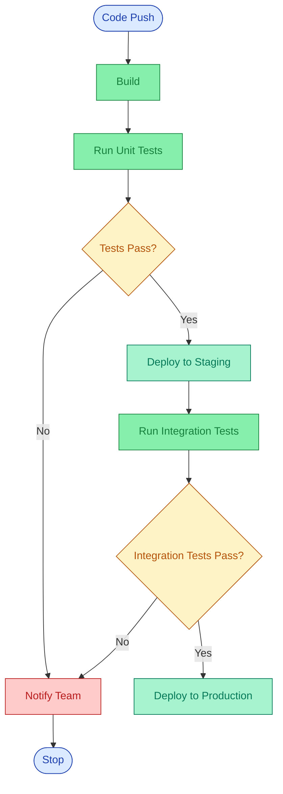

# CI/CD Pipeline Flowchart -- End-to-End Test Report

## User Prompt

> "Draw a flowchart for a CI/CD pipeline: code push triggers build, build runs tests, if tests pass deploy to staging, run integration tests, if those pass deploy to production, if any tests fail notify the team and stop."

## Type Selection: Flowchart

**Why:** The request describes step-by-step logic with conditional branching ("if tests pass", "if those pass", "if any tests fail"). Per the diagram-type-rubric.md, keywords "flow", "flowchart", "process", "steps", "decision", "if/else" all map to Flowchart. No ambiguity -- this is a textbook flowchart use case.

## Path: Mermaid

**Why:** The flowchart recipe (`diagram-recipes/flowchart.md`) specifies `mermaid-convert.js` as the tool. The SKILL.md workflow assigns flowcharts to the Mermaid path (flowchart, sequence, class, ER).

## Input File Content

File: `cicd-pipeline.mmd`

## Commands Run

| Step | Command | Result |
|------|---------|--------|
| Write input | Write `cicd-pipeline.mmd` | Created successfully |
| Convert | `node tools/mermaid-convert.js examples/flowchart/cicd-pipeline.mmd --output examples/flowchart/cicd-pipeline.excalidraw` | Success -- 34 elements, 35,582 bytes |
| Export PNG | `node tools/export.js examples/flowchart/cicd-pipeline.excalidraw --format png --output examples/flowchart/cicd-pipeline.png` | Success -- 504x1303px, 41,592 bytes |
| Validate | Read PNG with Read tool | Passed all checks |

## Visual Verification Notes

Validation performed by reading the exported PNG. Results:

- **All nodes labeled and readable**: All 10 nodes (Code Push, Build, Run Unit Tests, Tests Pass?, Deploy to Staging, Run Integration Tests, Integration Tests Pass?, Deploy to Production, Notify Team, Stop) have clear, legible labels.
- **No text overlap**: All labels fit within their containing shapes with adequate padding.
- **All connections present**: All 10 edges are rendered correctly, including both "No" paths converging on the Notify Team node.
- **Arrow directions correct**: Top-to-bottom flow. Decision diamonds branch right for "Yes" and left for "No". Both failure paths correctly converge on "Notify Team".
- **Color coding consistent**: Blue (start/end), green (process steps), yellow (decision diamonds), red (error/notify), teal (success/deploy). All colors match color-palette.md values.
- **Isomorphism test**: The structure communicates the pipeline flow without text -- diamond shapes indicate decisions, convergence of two arrows into the red node shows failure handling, and the linear happy path is visually distinct from error branches.

**Iterations needed**: 0 (passed on first render)

## Final Output Files

| File | Path |
|------|------|
| Mermaid source | `examples/flowchart/cicd-pipeline.mmd` |
| Excalidraw diagram | `examples/flowchart/cicd-pipeline.excalidraw` |
| PNG export | `examples/flowchart/cicd-pipeline.png` |

