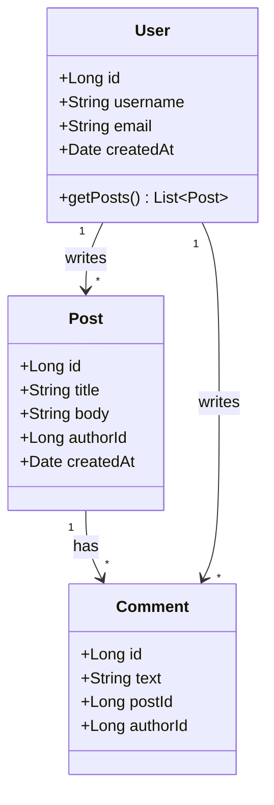

# Class Diagram Recipe

**Tool:** `mermaid-convert.js` (Mermaid syntax)

## When to use
Static structure — classes with fields/methods and typed relationships (inheritance, composition, association).

## Mermaid template

### Visibility modifiers
- `+` public
- `-` private
- `#` protected
- `~` package

### Relationship syntax
- `<|--` — inheritance
- `*--` — composition
- `o--` — aggregation
- `-->` — association
- `..>` — dependency
- `..|>` — implementation

### Cardinality
- `"1" --> "*"` — one-to-many
- `"1" --> "1"` — one-to-one

## Common pitfalls

1. **Too many attributes per class** — Show 5-7 most important. Add `...` for the rest.
2. **Inheritance direction** — Arrow points TO the parent (superclass).
3. **Generic types** — Use `~Type~` syntax for generics (e.g., `List~Post~`).
