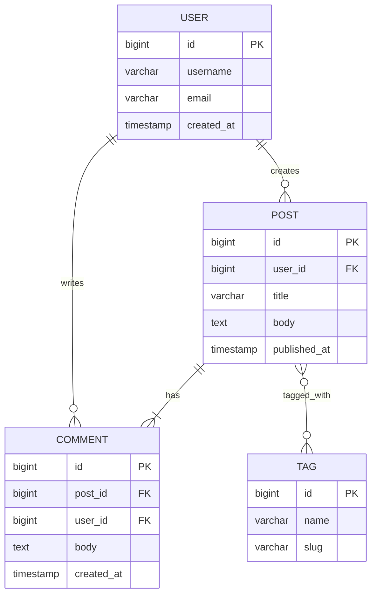

# ER Diagram Recipe

**Tool:** `mermaid-convert.js` (Mermaid syntax)

## When to use
Relational data models — tables, columns, and how tables relate (foreign keys, cardinality).

## Mermaid template



### Relationship syntax

| Notation | Meaning |
|----------|---------|
| `\|\|--o{` | one-to-many (exactly one to zero or more) |
| `\|\|--\|{` | one-to-many (exactly one to one or more) |
| `}o--o{` | many-to-many |
| `\|\|--\|\|` | one-to-one |
| `}o--\|\|` | many-to-one (zero or more to exactly one) |

### Attribute syntax
- `type name PK` — primary key
- `type name FK` — foreign key
- `type name` — regular column

## Entity colors

ER diagrams support per-entity coloring via Mermaid's `style` directive. Add these AFTER entity definitions:

```mermaid
    style USER fill:#dbeafe,stroke:#1e40af
    style POST fill:#a7f3d0,stroke:#047857
    style COMMENT fill:#fef3c7,stroke:#b45309
    style TAG fill:#ddd6fe,stroke:#6d28d9
```

Use semantic colors from `color-palette.md`. Always apply colors — without them entities render as white/transparent.

## Common pitfalls

1. **No colors without style directives** — Always add `style ENTITY fill:#hex,stroke:#hex` for each entity.
2. **Junction tables** — For many-to-many, Mermaid shows it directly. If you need the junction table visible, add it as a separate entity.
3. **Too many attributes** — Show 5-7 most important per entity.
4. **Missing cardinality** — Always specify both sides of the relationship.
