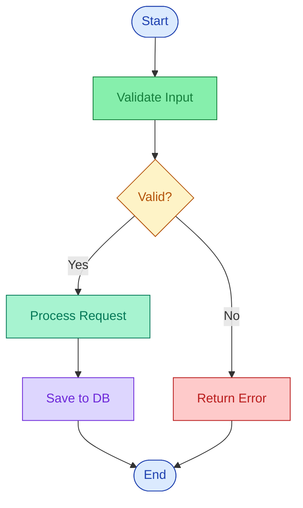

# Flowchart Recipe

**Tool:** `mermaid-convert.js` (Mermaid syntax)

## When to use
Step-by-step logic with conditional branching — user journeys, request lifecycles, decision trees, validation pipelines.

## Mermaid template

**IMPORTANT:** Always include `classDef` color classes. Without them, the flowchart renders as monochrome black and white.

### Standard classDef colors (from color-palette.md)

| Class | Purpose | fill | stroke | color |
|-------|---------|------|--------|-------|
| `start` | Start/End terminals | `#dbeafe` | `#1e40af` | `#1e40af` |
| `process` | Process steps | `#86efac` | `#15803d` | `#15803d` |
| `decision` | Decision diamonds | `#fef3c7` | `#b45309` | `#b45309` |
| `error` | Error/reject paths | `#fecaca` | `#b91c1c` | `#b91c1c` |
| `success` | Success/completion | `#a7f3d0` | `#047857` | `#047857` |
| `data` | Database/storage | `#ddd6fe` | `#6d28d9` | `#6d28d9` |
| `security` | Auth/security | `#fed7aa` | `#c2410c` | `#c2410c` |
| `async` | Async/queue | `#fef08a` | `#92400e` | `#92400e` |

### Shape syntax
- `[text]` — rectangle
- `{text}` — diamond (decision)
- `([text])` — rounded rectangle (start/end)
- `[(text)]` — cylinder (database)
- `((text))` — circle

### Edge syntax
- `-->` — solid arrow
- `-.->` — dashed arrow
- `-->|label|` — labeled arrow

### Applying classes
Append `:::className` to any node: `A([Start]):::start`

## Common pitfalls

1. **No colors without classDef** — Mermaid defaults to monochrome. Always define and apply classDef classes.
2. **Decision diamond labels too long** — Keep to ≤ 15 characters. Use abbreviations.
3. **Too many branches from one decision** — Split into cascading decisions.
4. **Forgetting the end node** — All paths should terminate at a named endpoint.
