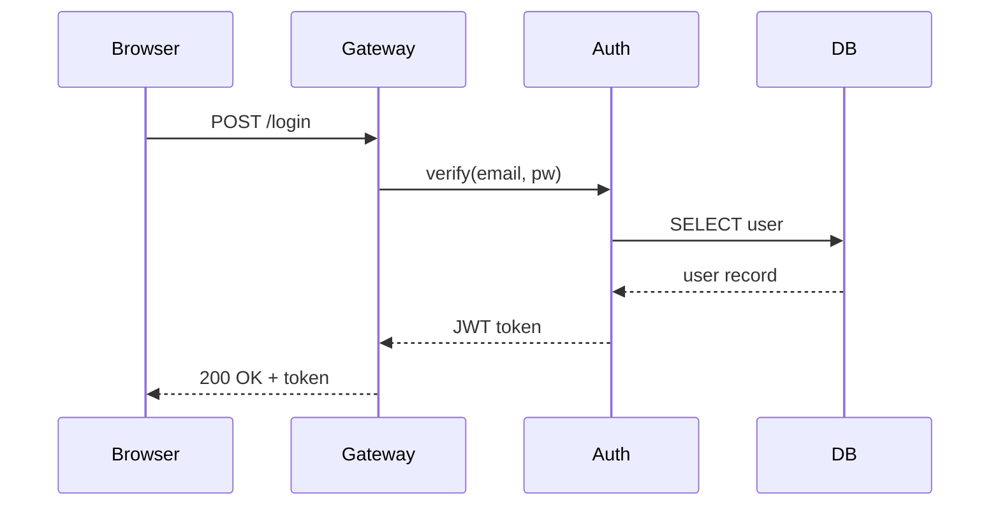

# Sequence Diagram Recipe

**Tool:** `mermaid-convert.js` (Mermaid syntax)

## When to use
Time-ordered message exchanges between named participants — auth flows, API request/response, event-driven protocols.

## Mermaid template

### Arrow syntax
- `->>` — solid arrow (request)
- `-->>` — dashed arrow (response)
- `-x` — solid with X (failed)
- `--x` — dashed with X (failed response)

### Features
- `Note over A,B: text` — spanning note
- `alt` / `else` / `end` — conditional blocks
- `loop` / `end` — loop blocks
- `activate` / `deactivate` — activation bars

## Color notes
Mermaid handles participant colors and arrow styles automatically. The output is native Excalidraw elements.

## Common pitfalls

1. **Too many participants** — 2-6 is ideal. Beyond 6, split into sub-diagrams.
2. **Missing return messages** — Every request should have a response arrow.
3. **Unclear direction** — Requests go left-to-right, responses right-to-left.
