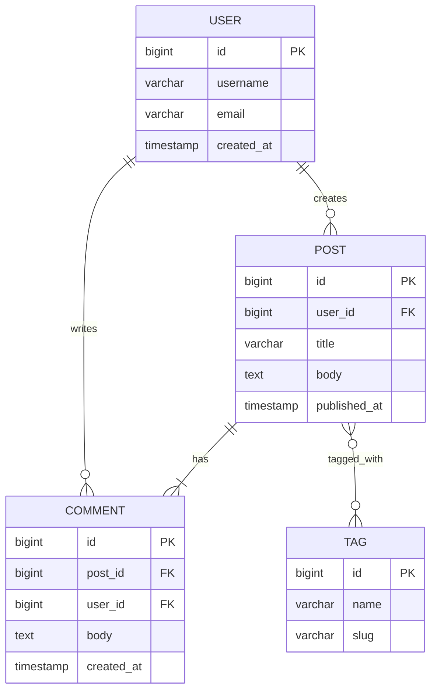

# ER Diagram Recipe

**Tool:** `mermaid-convert.js` (Mermaid syntax)

## When to use
Relational data models — tables, columns, and how tables relate (foreign keys, cardinality).

## Mermaid template

### Relationship syntax

| Notation | Meaning |
|----------|---------|
| `\|\|--o{` | one-to-many (exactly one to zero or more) |
| `\|\|--\|{` | one-to-many (exactly one to one or more) |
| `}o--o{` | many-to-many |
| `\|\|--\|\|` | one-to-one |
| `}o--\|\|` | many-to-one (zero or more to exactly one) |

### Attribute syntax
- `type name PK` — primary key
- `type name FK` — foreign key
- `type name` — regular column

## Common pitfalls

1. **Junction tables** — For many-to-many, Mermaid shows it directly. If you need the junction table visible, add it as a separate entity.
2. **Too many attributes** — Show 5-7 most important per entity.
3. **Missing cardinality** — Always specify both sides of the relationship.
