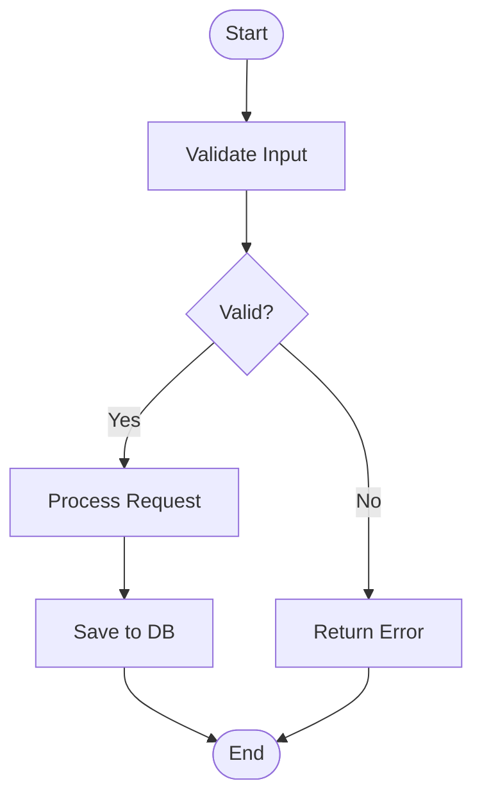

# Flowchart Recipe

**Tool:** `mermaid-convert.js` (Mermaid syntax)

## When to use
Step-by-step logic with conditional branching — user journeys, request lifecycles, decision trees, validation pipelines.

## Mermaid template

### Shape syntax
- `[text]` — rectangle
- `{text}` — diamond (decision)
- `([text])` — rounded rectangle (start/end)
- `[(text)]` — cylinder (database)
- `((text))` — circle

### Edge syntax
- `-->` — solid arrow
- `-.->` — dashed arrow
- `-->|label|` — labeled arrow

## Color notes
Mermaid-to-excalidraw produces native elements with default Excalidraw styling. For custom colors, use the dagre path instead.

## Common pitfalls

1. **Decision diamond labels too long** — Keep to ≤ 15 characters. Use abbreviations.
2. **Too many branches from one decision** — Split into cascading decisions.
3. **Forgetting the end node** — All paths should terminate at a named endpoint.
